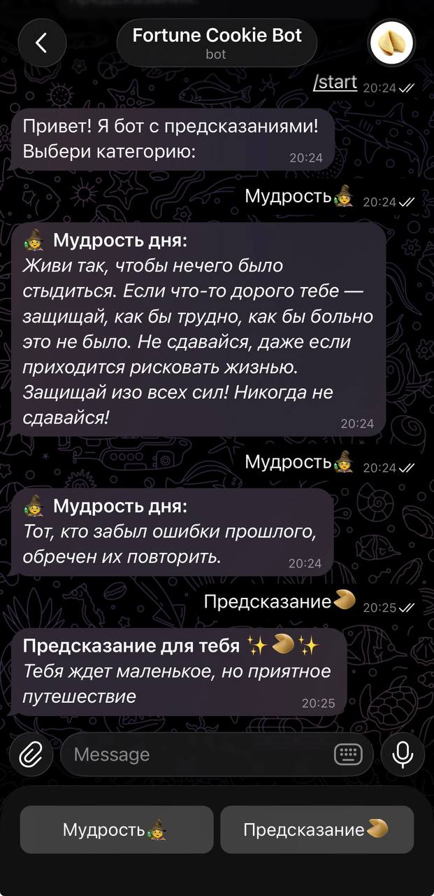

# Бот-предсказатель для Telegram

Этот проект представляет собой простого Telegram-бота, который отпраляет мудрые цитаты и забавные предсказания. Бот написан на Python с использованием библиотеки pyTelegramBotAPI.

Пользователь может выбрать одну из двух категорий, нажав на кнопки в чате, и получить случайное сообщение из соответствующего списка.



## Функционал

*   Готовые категории: Бот предлагает две кнопки: "Мудрость 🧙‍♀️" и "Предсказание 🥠".
*   Случайный выбор: При нажатии на кнопку бот отправляет случайное сообщение из выбранной категории.
*   Простота добавления контента: Все фразы хранятся в отдельном JSON-файле, поэтому их легко добавлять или редактировать без изменения кода.

## Технологии

*   Python (версия 3.8 или выше)
*   pyTelegramBotAPI - библиотека для работы с Telegram Bot API.
*   python-dotenv - для загрузки переменных окружения (токена бота) из файла .env.

## Структура проекта

── `src/main.py` : Основной файл с кодом бота 
── `data/fortunes.json` : Файл, содержащий все фразы и их типы 
── `requirements.txt` : Список зависимостей

## Установка и запуск

Чтобы запустить этого бота у себя, выполните следующие шаги:

1.  Клонируйте репозиторий: 
```
bash 
git clone https://github.com/nyanfisa/FortuneCookieBot.git
cd FortuneCookieBot
```

2. Создайте и активируйте виртуальное окружение:
```
bash 
python -m venv venv 

# Для Windows:
venv\Scripts\activate

# Для macOS/Linux:
source venv/bin/activate
```

3. Установите зависимости:
```
bash 
pip install -r requirements.txt
```

4. Настройте переменные окружения
- Создайте в корневой папке файл с именем `.env`
- Получите токен для своего бота в Telegram y [@BotFather](https://t.me/botfather).
- Откройте файл '.env' и добавьте туда следующую строку, заменив "YOUR_BOT_TOKEN' на ваш реальный токен: BOT_TOKEN=YOUR_BOT_TOKEN

5. Запустите бота:
```
bash
python main.py
```
